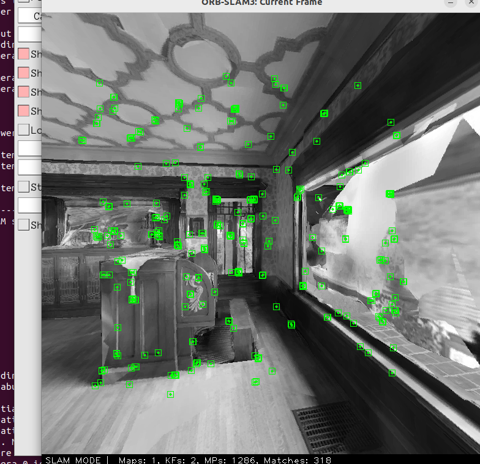
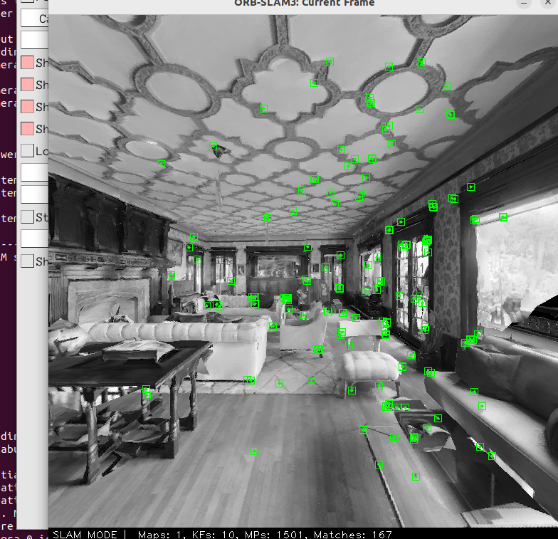

# ORB-SLAM3 for ROS 2 Humble

This repository contains a fully integrated workspace for running **ORB-SLAM3** natively on Ubuntu 22.04 and within **ROS 2 Humble**. It includes the core ORB-SLAM3 library (upgraded to C++14) and a ROS 2 wrapper that supports Monocular, Stereo, RGB-D, and Inertial sensors.

## Repository Structure

*   `ORB_SLAM3/`: The core ORB-SLAM3 library, modified to compile smoothly on Ubuntu 22.04 (GCC 11, C++14) without `libgdal` transitive linker errors.
*   `ros2_ws/src/ORB_SLAM3_ROS2/`: The ROS 2 Humble wrapper for ORB-SLAM3.

## Visuals
Here are some screenshots of the ORB-SLAM3 system actively tracking features on the OmniSLAM dataset:




## Prerequisites

*   Ubuntu 22.04
*   ROS 2 Humble
*   OpenCV 4.x
*   Pangolin
*   Eigen3

## Build Instructions

1.  **Source ROS 2**:
    ```bash
    source /opt/ros/humble/setup.bash
    ```
2.  **Build Core ORB-SLAM3** (If not already built):
    ```bash
    cd ORB_SLAM3
    chmod +x build.sh
    ./build.sh
    ```
3.  **Build ROS 2 Wrapper**:
    ```bash
    cd ../ros2_ws
    colcon build --cmake-args -DSophus_DIR=../ORB_SLAM3/Thirdparty/Sophus/install/share/sophus/cmake
    ```

## Usage

Before running any ROS 2 nodes, source the workspace and add the ORB-SLAM3 libraries to your `LD_LIBRARY_PATH`:

```bash
source /opt/ros/humble/setup.bash
source install/setup.bash
export LD_LIBRARY_PATH=$LD_LIBRARY_PATH:$(pwd)/../ORB_SLAM3/lib:$(pwd)/../ORB_SLAM3/Thirdparty/DBoW2/lib:$(pwd)/../ORB_SLAM3/Thirdparty/g2o/lib
```

### Running Nodes

**Monocular:**
```bash
ros2 run orbslam3 mono path_to_vocabulary path_to_settings
```

**RGB-D:**
```bash
ros2 run orbslam3 rgbd path_to_vocabulary path_to_settings
```

**Stereo-Inertial:**
```bash
ros2 run orbslam3 stereo-inertial path_to_vocabulary path_to_settings do_rectify [do_equalize]
```

## Running Custom Datasets (RGB-D)

To run custom datasets (e.g., OmniSLAM) directly through the core executable without ROS 2:
```bash
export LD_LIBRARY_PATH=$LD_LIBRARY_PATH:/path/to/ORB_SLAM3/lib
./ORB_SLAM3/Examples/RGB-D/rgbd_tum \
    ./ORB_SLAM3/Vocabulary/ORBvoc.txt \
    /path/to/custom_dataset.yaml \
    /path/to/dataset \
    /path/to/dataset/associations.txt
```
*(Note: Ensure you generate an `associations.txt` file linking RGB and Depth timestamps if they differ).*

## Troubleshooting

*   **Segmentation Fault on Exit**: It is normal for the standalone ORB-SLAM3 executables to throw a `Segmentation fault (core dumped)` or GTK warnings *after* the sequence finishes and trajectories are saved. This is a known thread-termination bug in Pangolin/ORB-SLAM3 on Ubuntu 22.04 and does not affect your results.
*   **Linker Errors (curl/tiff)**: If you experience linker errors regarding `libgdal`, ensure you are not compiling within an active Anaconda environment, as Conda library paths conflict with the system paths required by OpenCV/ROS2.
